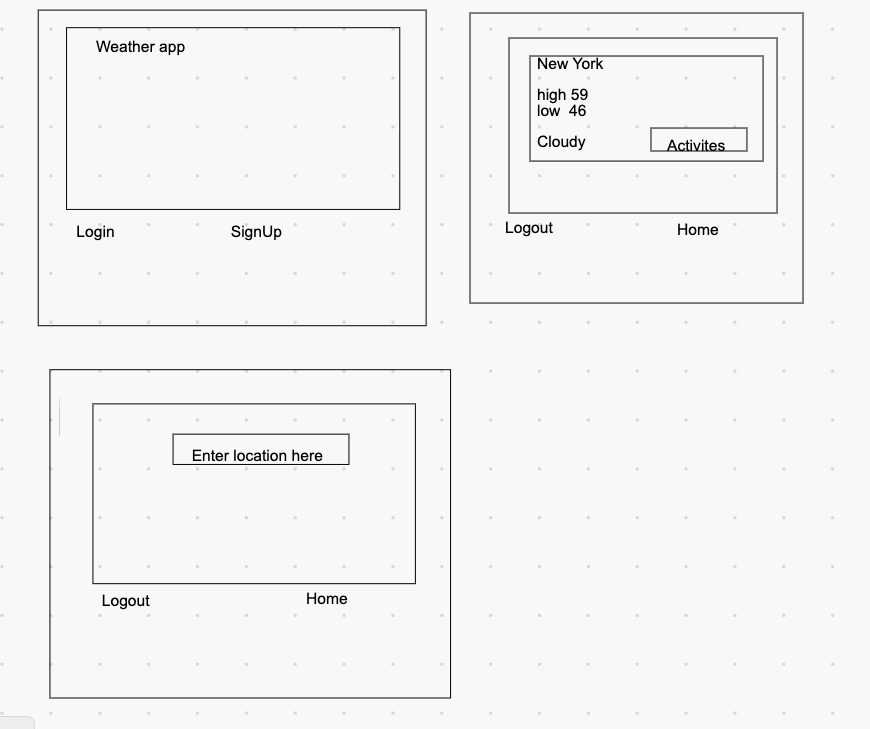
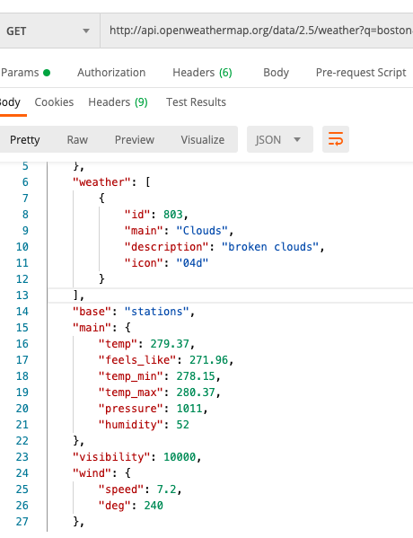
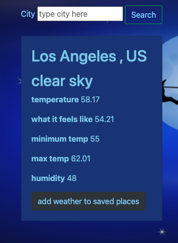

## Weather-APP

This is my second project done with general assembly a 12 week , 500 hour coding bootcamp. I decided to make a weather app beause I was always curious about how it works on my iphone. This app incorparates sequelize, express, a weather api and some styling using bootstrap.


If you would like to access/contribute you can fork this project at `https://github.com/fmuwanguzi/weather-app`. To clone to your local terminal use `git clone` and the link above.

You can also click on this link to use my app. Don't forget to signup.`https://my-weather-app.herokuapp.com`

If you are following along with code you will need to `npm install` in your terminal to install all dependencies. You also need to start running your migrations using `sequelize db:migrate`.


## I changed a a few things when I was making the app but this was my first wireframe



### Weather API and weather routes

### Some of the steps that I followed

Started by adding a `weather.js` file to my routes folder. This can be done in the terminal with `touch wether.js` or directly through vscode.

I then allowed my app to access the routes in that file by adding and I activited my view in enngine

```js 
app.set('view engine', 'ejs');

app.use('/weather', require('./routes/weather'));
```

I skipped ahead before that I set up my requirements at the top of `server.js`

```js
const express = require('express');
const router = express.Router();
const db = require('../models');
const axios = require('axios');
require('dotenv').config()

const app = express();
app.use(express.urlencoded({ extended: false }));
```

To begin working with the weather api I was interested I will need `axios`(to fetch the url) and `dotenv` to hide my API key.

If you would like to read more about the openweather api here is a link `https://openweathermap.org/api` I used the `current weather data api` but as a stretch goal or if time permits I would like to switch to the `one call api` which I learned about a few days into my project.

## Accessing the api key

First step you need to do is to register with openweathermap its free 🤝 , then you can get free api key. 

I then used `postman` which is a api client to look at some of the information I would get back using the api.

Here some information I got back.



I set up a weather page with a default location using the weather api. For my default city I picked Los Angeles, CA. 

```js

//set opening page in weather to Los Angeles 
let city = 'los angeles'
let API_KEY = process.env.API_KEY;

//added units=imperial to get the right units for United states 
let url = `https://api.openweathermap.org/data/2.5/weather?q=${city}&units=imperial&appid=${API_KEY}`

router.get('/', (req, res) => {
    console.log('---weatherGetRoute---');
    axios.get(url)
    .then((response) => {
        const myWeather = response.data
        res.render('weather', {myWeather})
    })
    .catch(error => {
        console.log(error);
        res.send(error = "refresh your screen");
    });
});

```
Also using some styling in my views for weather.
I added a search bar at the top and at the bottom a button to add weather to saved places.

```js

<center>
<form action="/weather" method="POST" class="search">
    <label style="color: lightskyblue" for="city">City</label>
    <input type="text" name="city" id="city" placeholder="type city here"> 
    <button type="submit" class="btn btn-outline-success my-2 my-sm-0" data-toggle="popover" style="color: lightskyblue" >Search</button>
</form>
</center>

<br>

<div class="card" style="width: 18rem;">
    
    <div class="card-body">
    <h2 class="card-title"> <%= myWeather.name %> , <%= myWeather.sys.country %> </h2>
    <h2 class="card-text"><%= myWeather.weather[0].description %> </h2>
    <p class="card-text"><b> temperature </b> <%= myWeather.main.temp  %> </p>
    <p class="card-text"><b>what it feels like</b>  <%= myWeather.main.feels_like  %> </p>
    <p class="card-text"><b>minimum temp</b> <%= myWeather.main.temp_min %> </p>
     <p class="card-text"><b>max temp</b> <%=myWeather.main.temp_max  %> </p>
     <p class="card-text"><b>humidity</b> <%= myWeather.main.humidity %> </p>

        <!-- button set up-->
        <form action="/weather/save" method="POST">
            <input hidden type="text" name="city" id="city" value="<%=myWeather.name%>">
            <input hidden type="text" name="country" id="country" value="<%=myWeather.sys.country%>">
            <input hidden type="text" name="description" id="description" value="<%=myWeather.weather[0].description%>">            
            <input hidden type="number" name="temperature" id="temperature" value="<%=myWeather.main.temp%>">
            <input hidden type="number" name="feels_like" id="feels_like" value="<%=myWeather.main.feels_like%>">
            <input hidden type="number" name="min_temp" id="min_temp" value="<%=myWeather.main.temp_min%>">
            <input hidden type="number" name="max_temp" id="max_temp" value="<%=myWeather.main.temp_max%>">
            <input hidden type="number" name="humidity" id="humidity" value="<%=myWeather.main.humidity%>">
            
            <button class="btn btn-dark" style="color: lightskyblue" data-toggle="popover">add weather to saved places</button>
        </form>
    </div>

```
## Here's a little preview of what that looks like.





## In the future

#### I would like to add an additional API which would alert the user of weather warnings as well as weather predictions for at least the next 3 days.

#### I would also like to incorporate moments into my appliction so when you open it you can see current date and time down the seconds.

#### I would like to have a drop down of suggested cities cause sometime we can't spell

#### Lastly if its something that wouldn't slow down the app.I would like to add better pictures/animations for the description of the weather. The ones that came with the API were a little dated to me.
